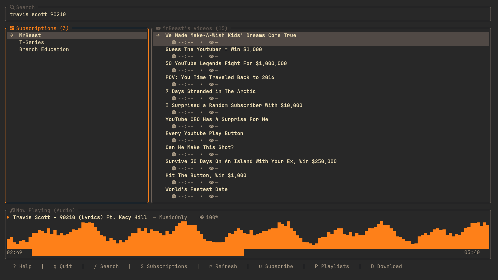
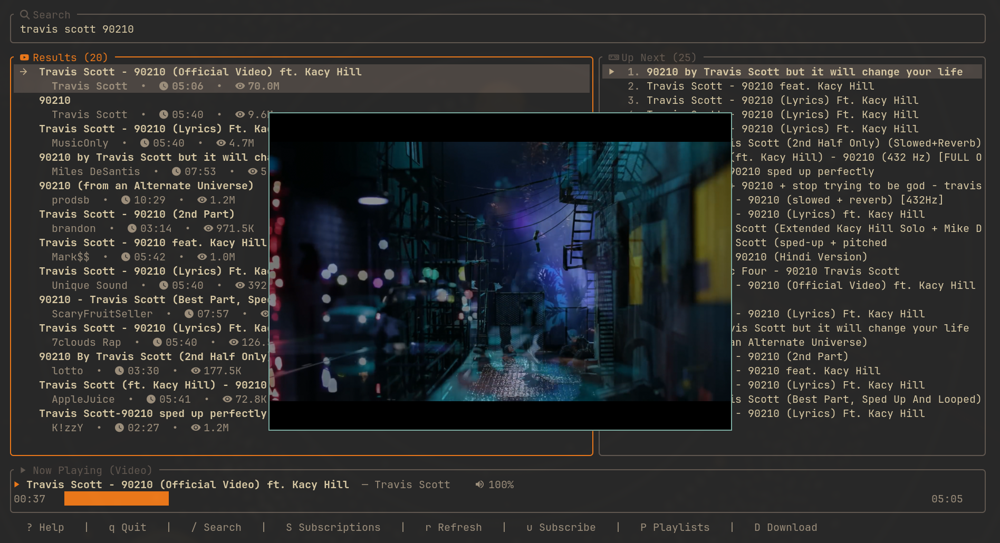

<p align="center">
  
</p>

<p align="center">
  <strong>A premium, lightning-fast Terminal User Interface (TUI) YouTube player and downloader.</strong>
</p>

<p align="center">
  <a href="https://github.com/ucmz851/ytplay-tui/actions/workflows/ci.yml"></a>
  <a href="https://crates.io/crates/ytplay-tui"></a>
  <a href="https://github.com/ucmz851/ytplay-tui/blob/main/LICENSE"></a>
  <a href="https://rust-lang.org"></a>
</p>

---

## ⚡ Overview

`ytplay-tui` is a lightweight, high-performance terminal utility written in Rust. It lets you search, stream, queue, and download YouTube content directly from your command line. Under the hood, it orchestrates a headless `mpv` process via local UNIX socket IPC and utilizes `yt-dlp` for lightning-fast downloads, wrapped in a beautiful, responsive Ratatui interface styled with a custom Gruvbox theme.

---

## ✨ Features

<table>
  <tr>
    <td width="50%">
      <h3>📺 Headless Streaming</h3>
      Stream video or bandwidth-saving <b>audio-only</b> tracks seamlessly in the background via local UNIX sockets connected directly to <code>mpv</code>.
    </td>
    <td width="50%">
      <h3>🔍 API-Keyless Search</h3>
      Perform instant, zero-configuration searches using custom scraping methods fallback-supported by public healthy Invidious API instances.
    </td>
  </tr>
  <tr>
    <td width="50%">
      <h3>💾 Local Playlists</h3>
      Organize tracks into customizable local playlists saved under your user config directory, built entirely offline.
    </td>
    <td width="50%">
      <h3>🔔 RSS Subscriptions</h3>
      Subscribe directly to your favorite creators to aggregate and refresh their latest uploads using YouTube's XML feeds.
    </td>
  </tr>
  <tr>
    <td width="50%">
      <h3>📥 Background Downloads</h3>
      Queue background downloads in different quality streams (1080p, 720p, or MP3 conversion) with real-time ETA, size, and speed readouts.
    </td>
    <td width="50%">
      <h3>🎨 Premium Visuals</h3>
      Immersive user experience built around a retro-modern Gruvbox palette with extensive Nerd Font icon layouts.
    </td>
  </tr>
</table>

---

## 📸 Screenshots

<p align="center">
  
  
</p>

---

## 📋 Prerequisites

Ensure these commands are installed on your system and available in your environment `PATH`:

- **Rust toolchain** (version 1.74+)
- **mpv** (configured with IPC support, standard on Linux/macOS)
- **yt-dlp** (ensure it is up-to-date to avoid streaming blocks)
- A **Nerd Font** active in your terminal emulator (e.g., FiraCode Nerd Font)

---

## 🚀 Quick Start & Installation

You can compile and automate the entire installation using the provided `Makefile`:

### Option A: User-Space Local Installation (Recommended)
This compiles the release target and sets up all binary assets, desktop application menus, and system icons inside your user home directory (does **not** require `sudo`):

```bash
# Clone the repository
git clone https://github.com/ucmz851/ytplay-tui.git
cd ytplay-tui

# Build and install locally
make install-user
```
> [!TIP]
> Ensure that `~/.local/bin` is added to your shell's `PATH` configuration (usually in your `.bashrc` or `.zshrc`) so your desktop launcher can find the command.

### Option B: System-Wide Installation
Installs `ytplay-tui` globally for all users on the machine:

```bash
# Build and install system-wide
sudo make install
```

### 🧹 Uninstallation
To completely scrub the application files from your system, run either:
- **Local user**: `make uninstall-user`
- **System-wide**: `sudo make uninstall`

---

## 🎮 Controls & Keybindings

Press `?` inside the app at any time to toggle the interactive Help menu.

### General App Navigation
- <kbd>q</kbd> or <kbd>Ctrl+C</kbd> — Quit
- <kbd>/</kbd> — Enter Search Mode (type query & press <kbd>Enter</kbd>)
- <kbd>Esc</kbd> — Return to normal mode / Clear focus
- <kbd>Tab</kbd> — Toggle panel focus (Feed, Playlists, Subscriptions)
- <kbd>?</kbd> — Toggle popup Help screen

### Playback Commands
- <kbd>Space</kbd> — Pause / Resume track
- <kbd>Enter</kbd> — Stream selected video
- <kbd>m</kbd> — Stream selected video as **Audio-Only** (no video window)
- <kbd>a</kbd> — Append selected track to the Queue
- <kbd>d</kbd> — Remove item from active focus (Queue, Playlist, or Subscriptions)
- <kbd>N</kbd> — Advance to next track in Queue
- <kbd>l</kbd> / <kbd>→</kbd> — Seek forward 5 seconds *(outside playlists)*
- <kbd>h</kbd> / <kbd>←</kbd> — Seek backward 5 seconds *(outside playlists)*
- <kbd>+</kbd> / <kbd>=</kbd> — Raise volume
- <kbd>-</kbd> — Lower volume

### Views & Management
- <kbd>P</kbd> — Focus local Playlists
- <kbd>S</kbd> — Focus Subscriptions feed *(use <kbd>Tab</kbd> inside to switch between Channels and Videos)*
- <kbd>D</kbd> — Open Download format selection for the selected video
- <kbd>c</kbd> — Create a new local playlist
- <kbd>s</kbd> — Save selected video into a playlist
- <kbd>u</kbd> — Subscribe / unsubscribe to the selected video's channel
- <kbd>r</kbd> — Pull latest RSS uploads (when Subscriptions pane is focused)

---

## 📂 Configuration Directories

All playlist, settings, and subscription states are serialized locally as human-readable JSON files:

- **Playlists**: `~/.config/yttui/playlists.json`
- **Subscriptions**: `~/.config/yttui/subscriptions.json`
- **Downloads Destination**: Media files are saved directly to `~/Downloads/`.

---

## 📈 Star History

Show your support for this project! Give it a star to watch the growth curve:

<p align="center">
  <a href="https://star-history.com/#ucmz851/ytplay-tui&Date">
    
  </a>
</p>

---

## 📄 License

Distributed under the MIT License. See [LICENSE](LICENSE) for more details.
