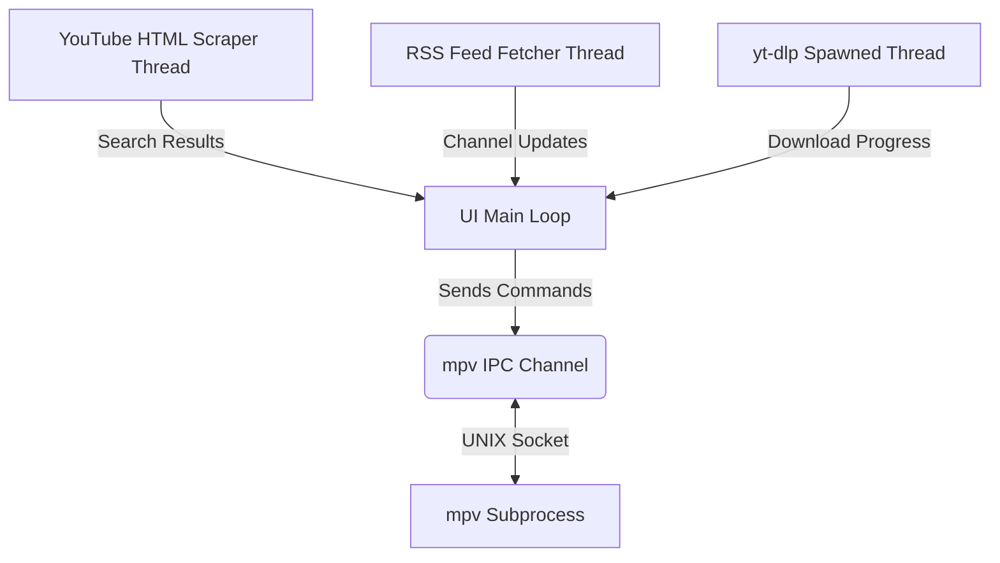

# 📘 ytplay-tui: Full User & Developer Guide

Welcome to the full guide for **ytplay-tui**. This document provides a complete walkthrough of the application's architecture, features, configuration, troubleshooting, and developer guide.

---

## 📖 Table of Contents
1. [Introduction](#introduction)
2. [Architectural Overview](#architectural-overview)
3. [Core Subsystems](#core-subsystems)
   - [TUI & Rendering Loop](#tui--rendering-loop)
   - [mpv IPC Control Subsystem](#mpv-ipc-control-subsystem)
   - [YouTube Scraper](#youtube-scraper)
   - [RSS Subscriptions Feed](#rss-subscriptions-feed)
   - [Background Downloader](#background-downloader)
4. [User Guide & Features](#user-guide--features)
   - [Interface Panes](#interface-panes)
   - [Volume & Playback Control](#volume--playback-control)
   - [Playlists](#playlists)
   - [Subscriptions](#subscriptions)
   - [Desktop Integration](#desktop-integration)
5. [Troubleshooting Guide](#troubleshooting-guide)
   - [Icons Render as Square Boxes](#1-icons-render-as-square-boxes)
   - [yt-dlp Errors (Unable to Stream or Download)](#2-yt-dlp-errors-unable-to-stream-or-download)
   - [mpv Fails to Start or Play](#3-mpv-fails-to-start-or-play)
6. [Developer Guide](#developer-guide)
   - [Code Layout](#code-layout)
   - [Running & Building](#running--building)
   - [CI/CD Pipeline](#cicd-pipeline)

---

## 1. Introduction

`ytplay-tui` is a terminal user interface (TUI) player for YouTube. It combines the speed of web scraping and RSS feeds with the lightweight playback of `mpv` and command-line versatility of `yt-dlp`. 

It is designed to be **highly performant**, **bandwidth-friendly** (supporting audio-only modes), and **aesthetic** (using a custom Gruvbox color palette).

---

## 2. Architectural Overview

The application utilizes a **single-threaded UI loop** with **background threads** handling asynchronous I/O (such as scraping, RSS fetching, and downloading). Communication between threads is done via standard multi-producer single-consumer (`mpsc`) channels.



This ensures that network requests never block the main thread, keeping the terminal responsive and the frame rate smooth (targeting 60 FPS).

---

## 3. Core Subsystems

### TUI & Rendering Loop
Built on `ratatui` (an active fork of `tui-rs`) and using `crossterm` as the backend. The main terminal interface splits the screen into:
1. **Search Bar**: Top input area for entering queries.
2. **Main Pane (Feed / Playlists / Subscriptions)**: Displays videos, subscriptions, or local playlists.
3. **Queue**: Displays upcoming tracks.
4. **Playback Bar**: Displays title, elapsed time, total duration, and volume.
5. **Download Panel**: Overlay/pane representing active background download status.

### mpv IPC Control Subsystem (`src/player.rs`)
Instead of embedding a heavy video library, `ytplay-tui` launches a local instance of `mpv` in an idle daemon state. 
- It sets `--input-ipc-server=/tmp/yttui-mpv-[PID].sock`.
- A background controller thread connects to the socket and observes properties such as `time-pos`, `duration`, `volume`, `pause`, and `idle-active`.
- Properties are converted to JSON and parsed continuously, updating the thread-safe `PlayerStatus` state.
- If `mpv` transitions to idle and the playback queue contains items, the app auto-advances.

### YouTube Scraper (`src/scraper.rs`)
To avoid complex Google Cloud API key requirements, `ytplay-tui` scrapes the standard YouTube search results HTML page. It mimics a clean browser request header, extracts the `ytInitialData` JSON object embedded in the HTML script tag, and maps it directly onto the internal `Video` models.

### RSS Subscriptions Feed (`src/scraper.rs`)
Subscriptions are populated via YouTube's public XML feed (`https://www.youtube.com/feeds/videos.xml?channel_id=...`). The app queries this XML feed using `reqwest` and parses the entries using regular expressions to extract video IDs, titles, and uploaders without external XML parser bloat.

### Background Downloader (`src/downloader.rs`)
Downloads are handled by spawning a child process running `yt-dlp`. By running with the `--newline` argument, `ytplay-tui` intercepts stdout lines and parses progress percentages using regex. This progress is sent back to the main loop to render a real-time progress bar.

---

## 4. User Guide & Features

### Interface Panes
Navigation is centered around focusing different panes via the `Tab` key.
- **Feed (Search Results)**: The landing zone. Pressing `Enter` here plays the selected search result.
- **Queue**: List of tracks scheduled to play. You can append any video to the queue by pressing `a`.
- **Playlists (`P`)**: Manages local playlists.
- **Subscriptions (`S`)**: Shows subscribed channels and their videos. Use `Tab` to jump between the channels column and the videos column.

### Volume & Playback Control
- Adjust volume with `+`/`=` to increase and `-` to decrease.
- Play/Pause with `Space`.
- Seek forwards/backwards 5 seconds with `→` and `←` (or `l` and `h` when not navigating playlists).

### Playlists
Playlists are defined locally under `~/.config/yttui/playlists.json`.
- Press `c` to create a new playlist.
- Press `s` on any selected video to add it to a playlist.
- Focus the Playlist pane and press `l` (Right) to expand and view the videos inside.
- Press `d` to remove a video from a playlist, or to delete the playlist entirely if focused on the header.

### Subscriptions
Subscribe to channels directly from search results by pressing `u`.
- View subscriptions in the Subscriptions Pane (`S`).
- Refresh your subscription feed with `r`.
- Press `d` on a channel inside the subscription list to unsubscribe.

### Desktop Integration
You can automatically install and integrate `ytplay-tui` into your desktop environment's launcher menu using the provided `Makefile`.

- **User-space local integration** (recommended, does not require `sudo`):
  ```bash
  make install-user
  ```
- **System-wide integration** (requires `sudo`):
  ```bash
  sudo make install
  ```

This automates the placement of the binary, the desktop launcher shortcut `ytplay-tui.desktop`, and the scalable SVG app icon to standard environment paths, followed by refreshing your launcher's application list registry.

---

## 5. Troubleshooting Guide

### 1. Icons Render as Square Boxes
- **Cause**: Your terminal emulator does not use a font that supports Nerd Font icons.
- **Solution**: Install a Nerd Font (such as FiraCode Nerd Font or Hack Nerd Font) and configure your terminal app (e.g., Alacritty, Kitty, iTerm2, GNOME Terminal) to use it.

### 2. yt-dlp Errors (Unable to Stream or Download)
- **Cause**: YouTube frequently updates its structural layout, causing older versions of `yt-dlp` to fail.
- **Solution**: Update `yt-dlp` to the latest version:
  ```bash
  sudo yt-dlp -U
  # or if installed via pip:
  pip install --upgrade yt-dlp
  ```

### 3. mpv Fails to Start or Play
- **Cause**: `mpv` might not be installed, or doesn't have permissions to create the IPC socket under `/tmp/`.
- **Solution**: Ensure `mpv` is installed on your system PATH. Test it manually in your terminal:
  ```bash
  mpv --version
  ```

---

## 6. Developer Guide

### Code Layout
- `src/main.rs`: Entrypoint, terminal initialization, event loop, and state coordination.
- `src/app.rs`: Application state definitions (`App`), pane enum declarations, and state changes.
- `src/ui.rs`: Layout construction, rendering methods using `ratatui` widgets.
- `src/keyboard.rs`: Keyboard event match block mapping input to state functions.
- `src/player.rs`: mpv IPC socket connector and command dispatcher thread.
- `src/downloader.rs`: Background `yt-dlp` download thread manager.
- `src/invidious.rs`: Invidious public instance crawler fallback.
- `src/scraper.rs`: Regex parsing for YouTube HTML search pages and channel feeds.
- `src/theme.rs`: Custom colors (Gruvbox) and Nerd Font symbols.
- `src/models.rs`: Serialization models for `Video`, `Playlist`, and `Subscription`.

### Running & Building
During development, run the project directly:
```bash
cargo run
```
To run static checks (Lints, formatting, build safety):
```bash
cargo fmt --all -- --check
cargo clippy --all-targets -- -D warnings
cargo test
```

### CI/CD Pipeline
Every pull request and push to the `master` or `main` branch runs a GitHub Actions workflow defined in `.github/workflows/ci.yml`. The workflow ensures:
1. Code compilability (`cargo check`).
2. Formatting compliance (`cargo fmt`).
3. Quality lints (`cargo clippy`).
4. Successful unit testing (`cargo test`).
